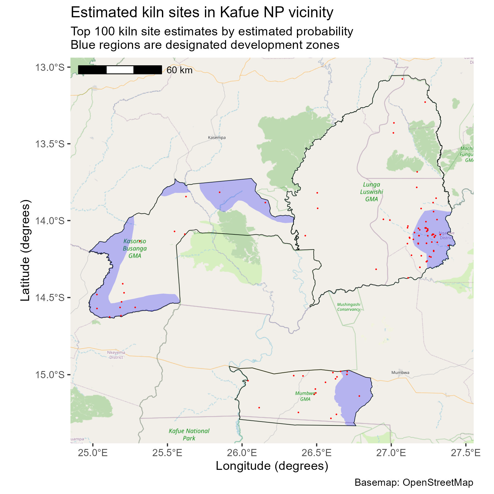

# Zambia EKNA kiln site estimation

### Top-100 kiln site estimates by Game Management Area (GMA)
- Lunga Luswishi GMA: 67
- Mumbwa GMA: 18
- Kasonso Busanga GMA: 15

### Top-100 kiln site estimates by development zone designation

Development zones comprise **16.6%** of the total area of the analyzed GMAs.

- Within development zones: 53
- Outside development zones: 47

## Methods

- See [exploring_inferences.qmd](test_2024/exploring_inferences.qmd) for calculation of the values above.
  - The raw results geometries were too large to attach. Use `test_2024/inferences_dedup.rds` instead of constructing the inferences dataset with this notebook's procedure.
- See [image_crosswalk.csv](subimage_selection/image_crosswalk.csv) for catalog of full-resolution images used, accessible through [Maxar G-EGD](https://evwhs.digitalglobe.com/myDigitalGlobe/login).
- Raw image files are not included in this repository due to storage size constraints.

### Replication

To replicate this analysis, execute the following steps:

1. Download the full-resolution TIFF images indicated in `subimage_selection/image_crosswalk.csv`.
2. Decompose the constituent TIFF images into tiles using the `test_2024/tile_subimages.sh` script.
3. Infer kiln sites using [detectron2](https://detectron2.readthedocs.io/en/latest/). (Use the [replication code provided by Verhegghen et al.](https://github.com/MartinezLaura/Kiln_detection/tree/main) as a guide.)
4. Follow the analysis in `test_2024/exploring_inferences.qmd` to obtain aggregate results from the output of the detectron2 system.

## PDRI-DevLab@Penn team
- Jack Jacobs, Data Scientist, jackjaco@sas.upenn.edu
- Ian Davis, Research Assistant, idavis1@sas.upenn.edu
- Heather Huntington, Associate Professor of Practice, hlarue@sas.upenn.edu
